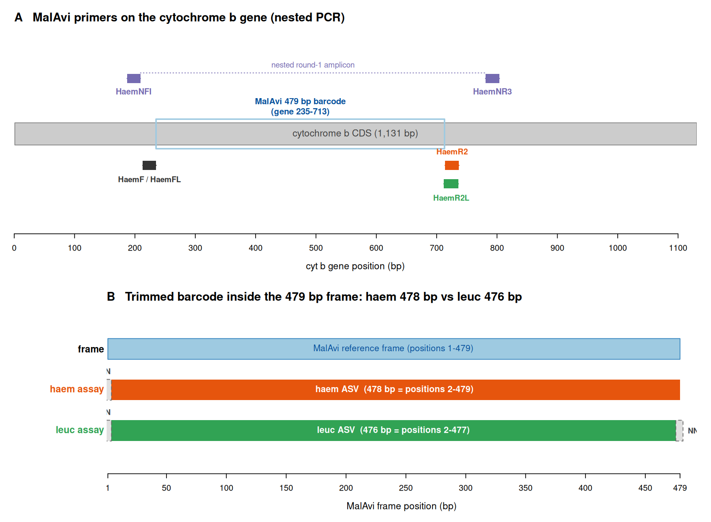

# MalAvi primer placement and the haem vs leuc barcode frame

*Reference note — created 2026-06-20. Lives with the project results so it can be
cited from the methods draft.*

## Summary

The MalAvi cytochrome *b* (cyt *b*) barcode reference frame is **479 bp for all
haemosporidian genera** (no indels in this window), but the two inner primer
pairs bracket slightly different sub-windows of it, so a clean, fully
primer-trimmed ASV is **not the same length** for the two assays:

| Assay | Inner primers | Clean ASV length | Position in 479 bp frame | Missing (N-padded) positions |
|-------|---------------|------------------|--------------------------|------------------------------|
| **haem** | HaemF / HaemR2 | **478 bp** | 2–479 | 1 |
| **leuc** | HaemFL / HaemR2L | **476 bp** | 2–477 | 1, 478, 479 |

The leuc reverse primer (HaemR2L) binds **two bases further into the barcode**
than the haem reverse primer (HaemR2), so leuc ASVs lose frame positions
478–479 in addition to position 1. **The 476 bp leuc ASVs are complete, not
truncated** — they are simply framed two bases shorter at the 3′ end.

This is why the original (haem-tuned) `asv_qc.R`, which only knew how to place
478 bp ASVs, screened **zero** Leucocytozoon ASVs (they are 476 bp and fell into
the "off-length" bin). `asv_qc.R` is now primer-aware (see "Pipeline fix" below).

## Figure



**(A)** The six MalAvi primers on the cyt *b* gene. The nested round-1 primers
(HaemNFI / HaemNR3) amplify a large fragment; the inner primers amplify the
479 bp MalAvi barcode (gene positions 235–713). The forward inner primers HaemF
(haem) and HaemFL (leuc) co-locate (gene 213–235); the reverse inner primers
differ — HaemR2L sits ~2 bp to the left (5′) of HaemR2.
**(B)** Inside the shared 479 bp reference frame, the haem trimmed ASV spans
positions 2–479 (478 bp) while the leuc trimmed ASV spans positions 2–477
(476 bp). Padded positions (N) are shown in grey.

## Real alignment example (clean, 100%-identity ASVs)

Each ASV padded into the 479 bp frame (`N` = absent forward-primer base at
position 1; `NN` = absent reverse-primer bases at positions 478–479) and aligned
against its nearest MalAvi lineage. `|` = match.

```
=========== HAEM example (positions 1-28, 5' end) ===========
Asv1 = P_SGS1 (Plasmodium relictum), 100% identity, 1,350,860 reads

P_SGS1_Plasmodium_relictum  GCAACTGGTGCTTCATTTGTATTTATTT
                             |||||||||||||||||||||||||||
Asv1 (478bp)                NCAACTGGTGCTTCATTTGTATTTATTT

=========== HAEM example (positions 452-479, 3' end) ===========
P_SGS1_Plasmodium_relictum  TTTTAGCACAAAGTTTATTTGGAATACT
                            ||||||||||||||||||||||||||||
Asv1 (478bp)                TTTTAGCACAAAGTTTATTTGGAATACT
                            ^ runs all the way to position 479 (no 3' pad)

=========== LEUC example (positions 1-28, 5' end) ===========
Asv1 = L_STOCC16, 100% identity

L_STOCC16     TCAACAGGAGCATCTTTTGTATTTATAT
               |||||||||||||||||||||||||||
Asv1 (476bp)  NCAACAGGAGCATCTTTTGTATTTATAT

=========== LEUC example (positions 452-479, 3' end) ===========
L_STOCC16     TCTTATTCCAAAGCTTATTTGGAATTGC
              ||||||||||||||||||||||||||
Asv1 (476bp)  TCTTATTCCAAAGCTTATTTGGAATTNN
                                        ^^ NN = absent reverse-primer bases
```

The 5′ ends are identical (both assays lose only position 1); the 3′ ends differ
— the haem ASV fills position 479, the leuc ASV stops at 477.

## Why 479 bp? The primer-masked positions carry lineage-defining variation

A natural question: if the leuc primers never see positions 478–479 (and neither
assay sees position 1), why does MalAvi define the barcode as the full 479 bp?
Because those terminal bases are **polymorphic across MalAvi lineages** and can be
the *only* difference between named lineages.

Base composition at the edge positions across all 5,365 bundled MalAvi lineages
(ACGT only; `-`/N = position not covered for that lineage):

| Frame pos | Covered | Composition | Lost by |
|-----------|---------|-------------|---------|
| 1   | 2,337 | G:1679, T:656, C:2 | both assays |
| 478 | 4,538 | T:2347, C:1129, G:1042, A:20 | leuc |
| 479 | 4,404 | T:3437, C:960, A:4, G:3 | leuc |

**Consequence for lineage discrimination.** Restricting to the 2,027 lineages
with complete (non-gap, non-N) coverage over all 479 positions, the number of
*distinct* sequences drops as the visible window shrinks: full [1–479] = 2,022 →
haem [2–479] = 2,019 → leuc [2–477] = 2,015. **Both assays lose discriminating
power, and this affects all three genera — not just Leucocytozoon.** There are
two separate effects:

**(a) Position 1 — lost by BOTH the haem and leuc assays.** Every primer-trimmed
ASV (haem *and* leuc) is missing position 1, the forward-primer base. Three
lineage pairs are distinguished **only** at position 1, so *no* deep-sequencing
amplicon from these primers can separate them — and these are *Plasmodium* and
*Haemoproteus* pairs:

| Pair (identical over positions 2–479) | pos 1 | Genus |
|---------------------------------------|-------|-------|
| **P_CINCOQ01 vs P_FOUSEY01** | G vs T | *Plasmodium* |
| **H_DELURB1 (*H. hirundinis*) vs H_RIPRIP02** | T vs G | *Haemoproteus* |
| **H_DELURB2 (*H. hirundinis*) vs H_RIPRIP07** | T vs G | *Haemoproteus* |

**(b) Positions 478–479 — additionally lost by the leuc assay only.** The leuc
reverse primer HaemR2L binds over positions 478–479, so leuc ASVs lose these on
top of position 1. Four further pairs are distinguished **only** at 478–479
(again across all three genera, including a real *Leucocytozoon* pair):

| Pair (identical over positions 2–477) | pos 478–479 | Genus |
|---------------------------------------|-------------|-------|
| **L_EMGOD07 vs L_EMGOD08** | TT vs GC | *Leucocytozoon* |
| P_RBQ03 vs P_YWT4 | TT vs CT | *Plasmodium* |
| H_SIAMEX01 vs H_TABI02 (*H. paruli*) | TT vs CT | *Haemoproteus* |
| H_QUEQUE03 vs H_QUERY01 | CT vs TT | *Haemoproteus* |

Under the MalAvi "1 bp difference = distinct lineage" rule, every pair above is a
pair of separate named lineages that the relevant deep-seq assay **cannot tell
apart** and will lump. This is the key practical caveat: a clean primer-trimmed
ASV that exactly matches one named lineage over the visible window may in fact
correspond to *either* of a lineage pair that differs only in a primer-masked
position. Flag such hits rather than assigning a single lineage with certainty.

*(Caveat: the collapse counts restrict to the 2,027 fully-covered lineages —
~3,000 MalAvi entries are already missing position 1 — so they are a
conservative, illustrative lower bound, not an exhaustive count. The named
example pairs are real.)*

## Implication: trim the primers cleanly and completely

The bases a read carries over the primer footprint (frame position 1 for both
assays; positions 478–479 additionally for leuc) come from the **primer**, not
the template — they are whatever the primer dictates, so they are not trustworthy
template observations and **must be trimmed**. Trimming the *entire* primer
therefore discards **no real template data**: every base under the primer
footprint is primer-derived, and the genuine template sequence begins immediately
outside the primer (frame position 2 at the 5′ end; position 477 at the 3′ end
for leuc), all of which is retained. The only information lost is template
variation that happens to fall *under* the primer — and that is unrecoverable
regardless of trimming (see the next box); the loss is a property of where the
primers sit, not of the trimming step. That has two consequences for how we run
the amplicon analysis:

1. **Trim the full primer at both ends, in two passes.** Use `cutadapt -g FWD`
   then `-a revcomp(REV)` (the pipeline does this). A single `-g X -a Y` call
   removes only one adapter per read and leaves a primer on the other end. This
   matters *more* here than for a generic amplicon: a leftover primer base sits
   exactly on a lineage-discriminating edge position (frame 1, or 478–479 for
   leuc) and injects the primer's fixed base as if it were a real template base —
   it can **fabricate or mask** a lineage difference at precisely the most
   sensitive positions. Under-trimming is worse than the (unavoidable) loss of
   those positions.

2. **Use ASV length as the trim-quality check, and do not silently reframe
   off-length ASVs.** A correctly trimmed ASV is **478 bp (haem)** or **476 bp
   (leuc)**. In our data the clean length carries ~99.9% of reads (e.g.
   experiment_haem 270/272 ASVs at 478 bp; ew_haem 99.98% of reads at 478 bp;
   raptor_haem 99.85% at 478 bp; raptor_leuc 1,075/1,084 ASVs at 476 bp).
   Off-by-one lengths (477/479 bp) are rare (<0.1% of reads — sequencing
   error-cloud / occasional indels) and are routed to `qc/asvs_off_length.tsv`
   for manual inspection, **not** auto-padded into the frame.

3. **Do not try to rescue the masked positions.** Represent them as `N`
   (missing), as `asv_qc.R` does. They are unrecoverable from these amplicons by
   design — which is also why MalAvi's full 479 bp reference comes from
   full-length / capture sequencing, and why the edge-distinguished lineage pairs
   listed above genuinely cannot be resolved from this amplicon data.

### "Couldn't we keep the primer bases instead, to avoid missing true variants?"

No — keeping them does the opposite of what it seems. In PCR the primer is
physically incorporated into every amplicon, so after the first cycle every copy
carries the **primer's** sequence across the primer-binding region, *regardless
of the template's true base there*. The sequenced base at frame position 1 (and
478–479 for leuc) is therefore the primer's base, not the template's — the true
variation at those positions is overwritten and is **not observable** with this
assay. Leaving the primer bases in would:

* make every ASV carry the **same constant, primer-derived** base at those
  positions (false homogeneity — not recovered variants); e.g. L_EMGOD07 and
  L_EMGOD08 would both show whatever HaemR2L dictates at 478–479 and remain
  indistinguishable, while presenting a fabricated base as if it were data; and
* be actively misleading, because positions 478–479 sit under the **3′
  (binding-critical) end of HaemR2L**: a template that truly differs there tends
  to **drop out** (fail to amplify) rather than reveal its variant, so the real
  signature of that variation is a *missing* lineage, not an observable SNP.

The only ways to actually see these positions are an assay whose primers do not
overlap them, or full-length / capture sequencing (which is what the MalAvi 479
bp reference is built from). For this amplicon, the honest representation is to
trim the primer bases and record those positions as missing (`N`).

## How this was established (three independent lines of evidence)

1. **In-silico PCR on full mtDNA genomes** (`/mnt/ellisbiostore/malaviTree`,
   `data/raw/backbone_mtdna_2026-06-15/backbone_avian.fasta`). Matching the
   actual primer sequences (IUPAC- and inosine-aware; `I` treated as N) against
   full genomes gives clean primer-trimmed inner lengths of **478 bp for haem
   (Plasmodium)** and **476 bp for leuc (Leucocytozoon)**.
2. **Gene-coordinate mapping.** On the cyt *b* CDS (1,131 bp; Plasmodium
   KY653776, Leucocytozoon PV948490), the inner forward primers both end at gene
   position 235; HaemR2 starts at gene 714 (→ barcode 236–713 = 478 bp) while
   HaemR2L starts at gene 712 (→ barcode 236–711 = 476 bp). The MalAvi 479 bp
   window is gene positions 235–713, so haem = frame 2–479 and leuc = frame
   2–477.
3. **BLAST of clean ASVs to the bundled MalAvi alignment** (malaviR 1.0.0,
   release 2026-03-23, 479 bp, 5,365 lineages). A 100%-identity 476 bp leuc ASV
   equals reference alignment positions 2–477 exactly (verified
   `ref[2:477] == ASV`), and 478 bp haem ASVs equal positions 2–479.

### Primer sequences used (5′→3′, as ordered)

```
HaemNFI   CATATATTAAGAGAAITATGGAG     (nested round-1 forward)
HaemNR3   ATAGAAAGATAAGAAATACCATTC    (nested round-1 reverse)
HaemF     ATGGTGCTTTCGATATATGCATG     (haem inner forward)
HaemR2    GCATTATCTGGATGTGATAATGGT    (haem inner reverse)
HaemFL    ATGGTGTTTTAGATACTTACATT     (leuc inner forward)
HaemR2L   CATTATCTGGATGAGATAATGGIGC   (leuc inner reverse; I = inosine)
```

## Pipeline fix

`pipeline/asv_qc.R` now auto-detects the primer set from the group's `run.log`
(`primer=haem` / `primer=leuc`; override with an optional second CLI argument)
and places clean ASVs into the 479 bp frame accordingly:

* **haem:** 478 bp → left-pad one `N` (→ positions 2–479).
* **leuc:** 476 bp → left-pad one `N` **and** right-pad two `N` (→ positions
  2–477).

`amplicon_qc()` treats `N` as missing, so the padded positions contribute
nothing to the biological-plausibility screen. ASVs that are not the expected
clean length are still reported separately in `qc/asvs_off_length.tsv` for manual
placement.

After this fix the leuc groups screen correctly (previously 0 ASVs screened):
`ew_leuc_240517` (5/6 ASVs placed) and `raptor_leuc_251126`.

## Reproduce

```bash
# figure
Rscript pipeline/R/plot_primer_frame.R              # -> results/notes/figures/primer_frame.{png,pdf}
# alignment example text -> results/notes/alignment_example.txt
# primer-aware QC
Rscript pipeline/asv_qc.R results/_runs_dada2/raptor_leuc_251126   # auto-detects leuc
```
